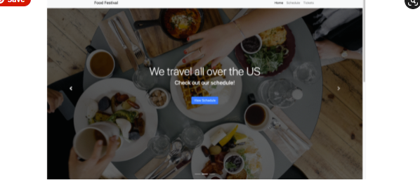

# food-festival
Module 19: PWAs

## Purpose
Help a client with an existing web application designed for a food festival. 
Because event attendees will use the app on their phones, it needs to be fast and performant, especially on mobile. 
But the application loads very slowly when the client tries to simulate a 4G internet connection using Chrome DevTools. 
Optimize the app by minifying assets, adding offline functionality, and turning it into a Progressive Web Application, or PWA.

## Built With
* Google Lighthouse
* webpack
* webpack-bundle-analyzer
* file-loader
* image-webpack-loader
* SW-precache-webpack
* webpack-PWA-manifest
* Git Hub

## Contribution
Made with ❤️ by Samantha Malone
Shout out to my tutor
© 2021 Samantha Malone. All rights reserved.
